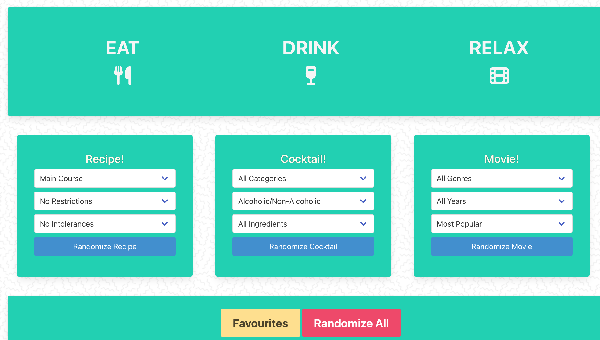

# Eat Drink Relax

## Description
Webpage for users to randomly generate ideas for meals, drinks and movies. Favorites can be saved to localStorage. Data is being retrieved from the Spoonacular API, TheCocktailDB API, and TMDB API.

## License  
This application is covered under the following license. Please review the link below for additional information pertaining to the license.
    
  
https://www.gnu.org/licenses/gpl-3.0

## Table of Contents
[Deployed Application](#deployed-application)  
[Built With](#built-with)  
[Landing Page](#landing-page)  
[Contribution](#contribution)  

## Deployed Application
https://dylanhay.github.io/EatDrinkRelax/

## Built With
* JavaScript
* HTML
* CSS
* Bulma
* jQuery
* Spoonacular API
* TheCocktailDB API
* TMDB API
* Git

## Landing Page

## Contribution
Built by Dylan Hay, Trevor Bos, Dianne Espeleta, Rob Duo, and Alexandre Savov